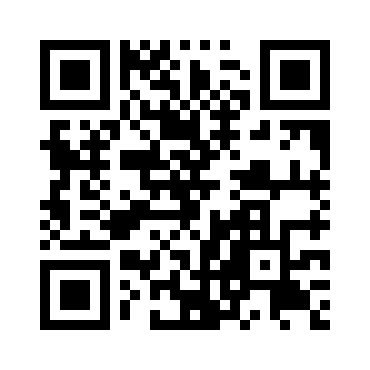

# Campaign URL QR Code Builder

Campaign URL QR Code Builder is an open‑source, self‑contained ASP.NET Core application for generating fully trackable campaign URLs and QR codes with UTM parameters.

It is designed to be simple, private, and easy to deploy—no database, no authentication, no external services required. The application is distributed as a Docker image and can be self‑hosted or run locally in seconds.



## Features

- Build URLs with all standard UTM parameters (`utm_source`, `utm_medium`, `utm_campaign`, `utm_id`, `utm_term`, `utm_content`)
- Auto-extracts existing UTM parameters when you paste a URL that already contains them
- Generates a 512 × 512 QR code in real time
- Optional centered image overlay (square PNG, max 5 MB, resized to 128 × 128)
- Save/load campaign configurations in browser `localStorage`
- Share a full configuration via a single URL (state encoded in query parameters)
- Download the finished QR code as a PNG

## Tech Stack

| Layer      | Technology                                                            |
| ---------- | --------------------------------------------------------------------- |
| Runtime    | .NET 8 / ASP.NET Core (static-file host only)                         |
| Frontend   | Vanilla HTML 5, CSS 3, JavaScript (no framework)                      |
| QR library | [QRCode.js](https://github.com/soldair/node-qrcode) (bundled locally) |
| Storage    | Browser `localStorage` (no database)                                  |

## Security

The server applies the following headers to every response:

| Header                    | Value                                                                           |
| ------------------------- | ------------------------------------------------------------------------------- |
| `Content-Security-Policy` | `default-src 'self'`; scripts from self + jsdelivr CDN; fonts from Google Fonts |
| `X-Content-Type-Options`  | `nosniff`                                                                       |
| `X-Frame-Options`         | `SAMEORIGIN`                                                                    |
| `Referrer-Policy`         | `strict-origin-when-cross-origin`                                               |

For production deployments it is strongly recommended to place the container behind a TLS-terminating reverse proxy (nginx, Caddy, Traefik, etc.) and add `Strict-Transport-Security`.

## Running locally (without Docker)

**Prerequisites:** [.NET 8 SDK](https://dotnet.microsoft.com/download/dotnet/8.0)

```bash
dotnet run --project qrcodes.csproj
```

The app listens on `http://localhost:5000` by default. Open that URL in a browser.

## Docker

### Quick start

Pull the image from Docker Hub and run it:

```bash
docker run --rm -p 4278:4278 kmsigma/utm-qrcodes:latest
```

Open `http://localhost:4278` in a browser.

## Deployment with Docker Compose

### Prerequisites

- [Docker Engine](https://docs.docker.com/engine/install/) 24+
- [Docker Compose](https://docs.docker.com/compose/install/) v2 (included with Docker Desktop)

### Start

```bash
docker compose up -d
```

Pulls the image from Docker Hub (if not already cached) and starts the container in the background. The app is available at `http://localhost:4278`.

### Stop

```bash
docker compose down
```

### Update to the latest image

```bash
docker compose pull && docker compose up -d
```

### Configuration

| Environment variable     | Default         | Description                            |
| ------------------------ | --------------- | -------------------------------------- |
| `ASPNETCORE_ENVIRONMENT` | `Production`    | ASP.NET Core environment name          |
| `ASPNETCORE_URLS`        | `http://+:4278` | Listening address inside the container |

To change the host port, edit the `ports` mapping in `docker-compose.yml`:

```yaml
ports:
  - "80:4278" # expose on host port 80 instead
```

### Building from source

If you want to modify the code and test your changes locally, build the image yourself:

```bash
docker build -t utm-qrcodes:local .
docker run --rm -p 4278:4278 utm-qrcodes:local
```

### Production notes

- The container runs as a non-root user (`appuser`).
- The filesystem is mounted read-only (`read_only: true`) with a `tmpfs` at `/tmp`.
- `no-new-privileges` is set to prevent privilege escalation.
- Place the container behind a reverse proxy to handle TLS, rate limiting, and access control.

### License

This project is licensed under the MIT License.

You are free to use, modify, and distribute this software, including for
commercial purposes. See the LICENSE file for details.
